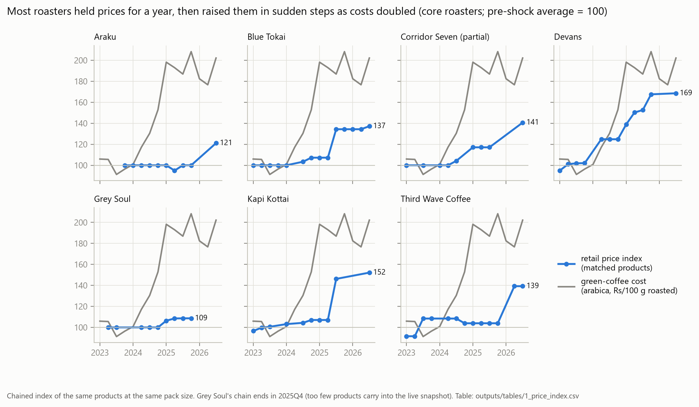
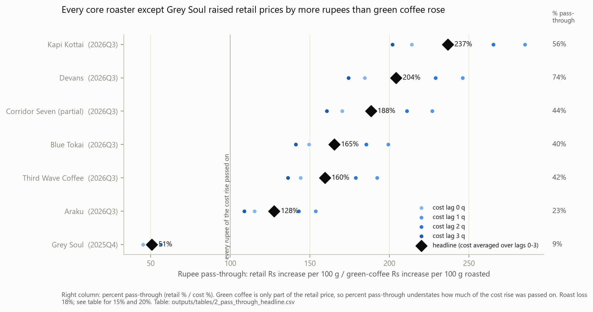
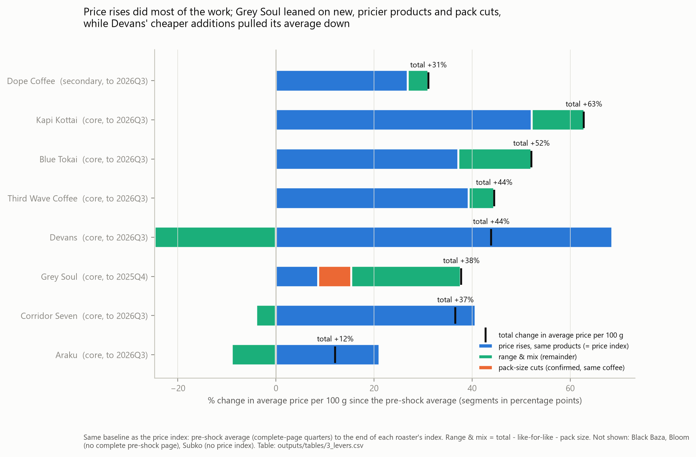

# How Indian specialty coffee roasters handled the 2024–25 price shock

## The problem

Green arabica roughly doubled in price between early 2024 and early 2025
(`1_cost_index.csv`: 101 in 2024Q1, 198 in 2025Q1). A roaster
deciding what to charge sees its own costs but not what its peers are doing.
It reprices blind.

This project benchmarks how the market actually responded. It follows the
shelf prices of 11 Indian specialty roasters every quarter from 2023Q1 to
2026Q3 and asks three questions:

- How much of the cost rise reached retail prices, and when?
- Which levers did roasters pull: price rises, pack-size cuts, or a change in
  what they sell?
- How did individual roasters differ?

Every number below comes from a file in `outputs/tables/`, named in brackets.
Full detail is in [docs/phase4.md](docs/phase4.md).

## Data

- **Retail prices:** roaster shop pages. History comes from Internet Archive
  (Wayback Machine) snapshots, one per quarter. 11 roasters: 7 "core" roasters
  with the best coverage, and 4 "secondary" ones used as a check.
  3,020 priced items, where an item is one product at one pack size in one
  quarter (`5_positioning.csv`, `n_items`).
- **Green coffee cost:** World Bank monthly arabica price (Pink Sheet),
  converted to rupees with the FRED INR/USD rate, per 100 g of roasted coffee
  (18% roast loss assumed; 15% and 20% as checks).
- **General inflation:** India CPI from MOSPI. Two base years (2012 and 2024)
  are spliced over their 12-month overlap (`2_cpi_splice.csv`).

## Method

- **Scraping.** Every request checks robots.txt, is rate-limited, and is
  cached in `data/raw/` so nothing is fetched twice. Sites whose terms forbid
  automated access were skipped.
- **Product attributes.** An LLM (Gemini) reads each product's text and
  returns origin, process, roast level and so on. Every answer is checked with
  pydantic: values must come from an allowed list, and any value other than
  "unknown" must quote evidence found word for word in the product's text.
  Answers that fail go to a review queue. Every response is cached.
- **Price index.** A chained index of the same products at the same pack
  size. Products coming and going, and pack-size changes, can't move it.
  Pre-shock average (2023Q1–2024Q1) = 100.
- **Pass-through in rupees.** Retail rupee increase per 100 g divided by the
  green-coffee rupee increase per 100 g. Percent pass-through understates it,
  because green coffee is only part of the retail price.
- **Levers.** A roaster's average price per 100 g can rise three ways: price
  rises on the same products, pack-size cuts at the same price, or a change in
  the product range. The split uses the same baseline as the index. The range
  part is what's left over, not measured directly.

## Validation

On 80 held-out, hand-labelled products, the LLM's raw output was right
**93.6%** of the time, averaged over the 8 fields that matter
(`0_label_accuracy.csv`). The weakest field is origin type (76.2%), which the
analysis replaces with a rule-based version. The labels were written blind
and never changed after seeing model output. Details in
[docs/phase3.md](docs/phase3.md).

## Findings

### 1. Prices rose by more rupees than green coffee did, but a year or more late



- Green coffee rose by Rs 42 per 100 g roasted, +92%, by 2026Q3
  (`2_pass_through_headline.csv`).
- The median core roaster raised retail prices by 165% of that rupee increase
  (`2_pass_through_headline.csv`).
- Part of that is general inflation: CPI rose 12.6% over the same period
  (`2_cpi_quarterly.csv`). Taking it out, the median core roaster passed on
  109% of the cost rise, about all of it (`2_pass_through_real_cpi.csv`).
- Prices moved in a few big steps, not smoothly. The median core roaster's
  biggest step came 5 quarters after costs started rising in 2024Q2
  (`1_step_timing.csv`). Devans moved at once; Blue Tokai and Kapi Kottai
  waited 5 quarters; Third Wave and Araku 7 or more.



### 2. Roasters pulled different levers



From the pre-shock average to the latest quarter (`3_levers.csv`):

- **Price rises on the same products** did most of the work for every core
  roaster except Grey Soul.
- **Moving upmarket:** Blue Tokai and Kapi Kottai also shifted to pricier
  coffees, adding about 15 and 11 percentage points on top of their price
  rises.
- **Moving downmarket:** Devans raised same-product prices by 69%, but its
  range moved to cheaper coffee, so its average price per 100 g rose only
  44%. Araku: 21% and 12%.

### 3. Grey Soul barely raised prices on the same products, but its average still rose 38%

- Same-product prices rose only 8.6% by 2025Q4, the smallest rise of any core
  roaster (`3_levers.csv`). On that measure alone, it looks like Grey Soul
  absorbed the cost: 51% rupee pass-through (`2_pass_through_headline.csv`).
- But its average price per 100 g rose 37.8% (`3_levers.csv`):
  - about 22 points from newer, pricier coffees (median Rs 350 per 100 g
    added vs Rs 260 dropped);
  - about 7 points from pack-size cuts.
- The pack-size cuts were 3 products, cut from 250 g to 200 g (and 500 g to
  400 g) at an unchanged shelf price: 20% less coffee, 25% more per 100 g.
  All three were later repriced upward as well, e.g. two 200 g packs went from
  Rs 699 to Rs 799 by 2026Q3 (`3_size_cuts.csv`).

Also in [docs/phase4.md](docs/phase4.md): attribute premiums from a hedonic
regression (chart 4) and price level vs repricing (chart 5).

## Limitations

- **No sales data.** This shows what roasters charged, not what customers
  bought. Nothing here says anything about demand.
- **Quarterly snapshots.** A price step is dated to a quarter at best, and
  some steps span gaps in the archive (`1_step_timing.csv`, `span_quarters`).
- **Few roasters.** 11 roasters, 7 core. Patterns across roasters are
  descriptive, not tested.
- **Coverage gaps.** Corridor Seven's evidence is partial; Grey Soul's index
  ends in 2025Q4; Subko has too few matched products for an index.
- **Range and mix is a remainder,** not measured directly.
- **Roast loss is assumed** at 18%. At 15% or 20% the median core rupee
  pass-through is 171% or 161% instead of 165%; the conclusions don't change
  (`2_pass_through_headline.csv`).
- **Shelf prices only.** Coupon codes, subscriptions and bulk discounts are
  not captured.

## What I'd do next

- **Measure demand.** Get sales or volume data from a roaster to see how
  customers responded to the price steps, pack cuts and range changes.
- **Run it monthly.** The live tracker below now collects prices every month.
  Next would be adding green-coffee costs to it, so it can report pass-through
  as it happens.

## Live tracker

<!-- tracker:last-run -->
**Last run: 2026-09-30** (snapshot 2026-09). Roasters fetched: 0; already had this month's data: 11; skipped by robots.txt: 0; switched off: 0; failed: 0. New products this run: 0; attributes pending: 0.
<!-- /tracker:last-run -->

A GitHub Actions workflow ([.github/workflows/tracker.yml](.github/workflows/tracker.yml))
runs on the 1st of every month, and can be started by hand from the Actions tab.
It:

1. re-reads each roaster's robots.txt and skips any roaster that disallows
   access (or whose robots.txt can't be read);
2. fetches each roaster's live `products.json`, with the same rate limits as
   the rest of the project, and appends the month to
   `data/clean/live_monthly.csv`;
3. asks Gemini for the attributes of products it hasn't seen before. The key
   comes from GitHub Secrets and is a free-tier key with no billing, so the
   tracker can't incur charges. If the API fails for any reason, including
   running out of quota, those products are marked "pending" and retried next
   month;
4. rebuilds the tracker tables and chart in `outputs/tracker/`, and checks
   that the historical analysis still reproduces exactly;
5. commits the results as "Live tracker: YYYY-MM snapshot".

If a step fails, the run logs an error and stops before anything is written
or committed.

**Some roasters' sites block cloud servers.** A roaster skipped or failing in
GitHub Actions doesn't mean the scraper is broken: the same request often
works from a home connection. Each month's outcome per roaster is in
`data/clean/live_monthly_status.csv`.

**What changes every month**

- `data/clean/live_monthly.csv`: one row per variant per month. The first
  month (2026-09) is the live snapshot used by the historical analysis.
- `outputs/tracker/`: same-product price index by month
  (`tracker_index.csv`, `tracker_index.png`), this month's changes
  (`tracker_changes.csv`: price rises and cuts, pack-size changes, products
  added and dropped), and a per-roaster summary (`tracker_summary.csv`).
- Attributes for new products (`data/clean/tracker_attributes.csv`) and
  anything needing a person (`data/review/tracker_review.csv`).
- The "Last run" line above.

**What stays fixed**

- The 2023–2026Q3 analysis: `outputs/tables/`, charts 1–5, every number in
  this README's findings and in [docs/writeup.md](docs/writeup.md). The
  tracker never writes to those files, and every run fails if they would
  come out differently.
- Green-coffee costs and CPI are not updated by the tracker. They're manual
  downloads, as before.

## Reproduce

Setup (Windows PowerShell):

```powershell
python -m venv .venv
.\.venv\Scripts\Activate.ps1
pip install -r requirements.txt
copy .env.example .env   # add a Gemini key only if you re-run the LLM step
pytest
```

**Analysis only** (uses `data/clean/`, `data/external/` and
`data/labels/`; no web requests, no API key):

```powershell
python -m src.analysis.run                 # all tables in outputs/tables/ and charts 1-5
python -m src.extract_attributes accuracy  # accuracy table (0_label_accuracy.csv); no LLM calls
```

**Product descriptions aren't redistributed.** The roasters' product
descriptions and listing-card text are their own copy, so they are not in
this repo: the committed files keep product IDs, titles, prices, pack sizes,
the hand labels, and the LLM's attributes with short evidence quotes. The
analysis runs entirely from those. Re-running an LLM step (extraction,
matching, the labelling workbook) needs the text, so it needs a fresh
scrape first: `python -m src.collect stage1`, then
`python -m src.product_inputs`, which writes the text to git-ignored
`data/local/`. Live descriptions will be whatever the shops show today, so
LLM results may differ slightly from the committed ones. A test
(`tests/test_no_shop_text.py`) fails if the text ever reaches a committed file.

**Full rebuild** (slow: fetches from the Wayback Machine at a polite rate;
the LLM step needs `GEMINI_API_KEY` in `.env`):

```powershell
python -m src.scout                        # Phase 1: robots.txt, Shopify, archive coverage
python -m src.collect stage1               # Phase 2: archived and live listings
python -m src.collect stage2               #   product pages for missing pack sizes
python -m src.size_report                  #   pack-size changes
python -m src.costs                        #   green-coffee cost per 100 g roasted
python -m src.product_inputs               # Phase 3: LLM inputs
python -m src.extract_attributes run       #   attributes (LLM, cached)
python -m src.matching                     #   links across product-ID changes (LLM, cached)
python -m src.product_keys                 #   follow each coffee over time
python -m src.analysis.run                 # Phase 4: analysis
```

**Live tracker, locally** (what the monthly workflow runs):

```powershell
python -m src.tracker.run                  # this month's snapshot (--no-llm to skip Gemini)
python -m src.tracker.check_history        # historical tables still reproduce exactly
```

## Layout

| Path | Contents |
|---|---|
| `src/` | Pipeline code. `http_client.py` is the only way to hit the web; `llm/` is the provider-agnostic LLM layer; `analysis/` is Phase 4 |
| `data/clean/` | Tidy tables produced by the pipeline |
| `data/external/` | Downloaded cost and CPI files, dated in the filename |
| `data/labels/` | Hand labels used for validation |
| `data/raw/`, `data/cache/` | Cached web pages and LLM responses (not committed) |
| `outputs/` | Charts; `outputs/tables/` holds every number |
| `docs/` | Phase notes and the write-up |
| `tests/` | `pytest`; network and LLM are faked |
